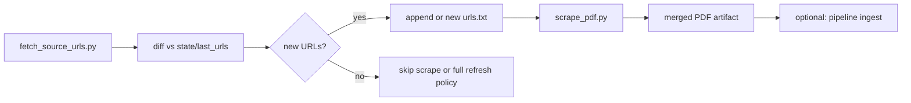

# Press release → structured PDF (agent guide)

This document is for **agents and humans** who add or refresh **press-release sources** for CaseLinker. It covers:

**listing/search page → article URLs → per-article PDFs → one merged PDF**

---

## Press release sources

Every article in the merged PDF must be a **self-contained press-release page** with a predictable header block:

1. **Title** (headline)
2. **Byline** (optional human date under the title)
3. **`Publication date: YYYY-MM-DD`** (when we can resolve it — helps downstream year assignment)
4. **`Source: https://…`** (canonical article URL — **required**; downstream splitting keys off this line)
5. **Body** (paragraphs of the release, not site chrome)

`scrape_pdf.py` builds that layout with ReportLab and merges pages with `pypdf`. Generic HTML works for many sites; some hosts need **host-specific extractors** in `extract()` or Jina cleanup in `extract_from_jina_reader()`.

---

## Prerequisites

From repo root (or `scripts/scraper/`):

```bash
pip install requests beautifulsoup4 reportlab pypdf pdfplumber
```

Optional but useful: `curl` for quick HTML probes without running Python.

---

## Canonical workflow (new source)

Do these steps **in order**. Do not skip verification.

### 1. Find the listing surface

Identify where the agency publishes what you care about:

| Pattern | Examples |
|--------|----------|
| Site search `?s=…` / `?q=…` | Osceola `?s=ICAC`, Iowa DPS `?q=ICAC` |
| Dedicated news index | `/news/`, `/media-relations/`, `/press-releases/` |
| Paginated search template | `…&page={page}`, `start=0,20,40`, `start_rank=1:91:10` |
| Squarespace search | HTML search page + `/api/search/GeneralSearch?q=…&p=…` |
| Google Programmable Search (CSE) | Widget on `/search?goog=…#gsc.q=…` — static HTML has no hits; use `--google-cse-search-page` (Jina + sitemap slug resolve) |
| Drupal / WordPress search | `search/node?keys=…&page={page}` |

**Topic is not limited to ICAC.** Use keywords that match the future CaseLinker domain (e.g. `trafficking`, `human trafficking`, `CSAM`, task force name, statute language the agency uses in headlines).

### 2. Verify one article in the browser

Open **one** result link. Confirm:

- The page is a **real press release** (not a program overview, award, newsletter index, or search page).
- Body text is substantial (roughly **≥ 80 characters** after stripping nav — that is `MIN_BODY_CHARS` in `scrape_pdf.py`).
- You can see a plausible **publication date** (meta tag, visible dateline, or URL path like `/2024/03/15/`).

If the listing mixes good and bad links, you will filter with **require/exclude substrings** when harvesting URLs (step 3), not by hoping scrape fixes it.

### 3. Harvest article URLs

**Option A — `fetch_source_urls.py`** (preferred when many pages share one listing pattern):

```bash
cd scripts/scraper

# Single search / listing page
python3 fetch_source_urls.py \
  --url 'https://www.example.gov/search?q=trafficking' \
  --same-host \
  --path-prefix /news/ \
  --require-any trafficking \
  --exclude /search --exclude /tag/ --exclude /feed/ \
  -o sources/example_trafficking_urls.txt

# Paginated template (inclusive range)
python3 fetch_source_urls.py \
  --url-template 'https://www.example.gov/search?page={page}&q=ICAC' \
  --page-range 0:5 \
  --same-host \
  --path-prefix /press/ \
  -o sources/example_icac_urls.txt
```

**Option B — manual `urls.txt`** (preferred for small, curated sets or after manual cleanup):

- One `https://` URL per line
- Lines starting with `#` are comments
- Order is preserved in the merged PDF

Put working lists under `scripts/scraper/sources/<agency>_<topic>_urls.txt` (create `sources/` as needed). Keep a short-lived `urls.txt` only when you are about to run `scrape_pdf.py` in one shot.

**Harvest hygiene (always):**

- Exclude: `/search`, `?s=`, `/page/`, `/tag/`, `/category/`, `/feed/`, `rss`, `wp-content`, login, newsletter shells.
- Require (when needed): topic tokens in the path or slug (`trafficking`, `icac`, `arrest`, `csam`, etc.).
- Deduplicate: same article with/without trailing slash — normalize to one form.
- Open 2–3 random URLs from the file before scraping the full list.

**`fetch_source_urls.py` toolbox:**

| Flag | Use when |
|------|----------|
| `--same-host` | Drop off-domain links |
| `--also-host` | Allow CDN or second domain (repeatable) |
| `--path-prefix` | Only paths under `/news/` etc. |
| `--require-any` / `--require-any-from FILE` | URL must contain one substring |
| `--exclude` / `--exclude-from FILE` | Drop listing/tag/feed URLs |
| `--stop-if-text` | Stop pagination when “no results” appears |
| `--url-template` + `--page-range` | Numeric pages (`0:29` or stepped `1:91:10`) |
| `--raw-url-regex` | URLs only in JSON-LD / Search.gov HTML |
| `--squarespace-search-page` | Anchorage-style Squarespace search API |
| `--google-cse-search-page` | Google CSE listing (e.g. USSS `search?goog=ICAC#gsc.q=ICAC&gsc.page=1`) |
| `--cse-sitemap` | Sitemap for expanding truncated CSE slugs (defaults to `{host}/sitemap.xml`) |
| `--cse-max-results` | Cap harvest count after filters |
| `--insecure` | Broken TLS chain on government host |
| `--allow-http` | Rare legacy http links |

### 4. Probe extract on one URL (before full batch)

```bash
cd scripts/scraper
python3 - <<'PY'
import importlib.util, subprocess
from pathlib import Path

spec = importlib.util.spec_from_file_location("scrape_pdf", "scrape_pdf.py")
mod = importlib.util.module_from_spec(spec)
spec.loader.exec_module(mod)

url = "https://www.example.gov/one-article/"
html = subprocess.run(
    ["curl", "-sS", "-L", "-A", "Mozilla/5.0", url],
    capture_output=True, text=True, check=True,
).stdout
r = mod.extract(html, url)
if r:
    title, byline, body, pub = r
    print("title:", title[:80])
    print("byline:", byline)
    print("pub:", pub)
    print("body chars:", len(body))
    print("body preview:", body[:400])
else:
    print("extract returned None (body too thin or no container)")
PY
```

**Healthy signals:** title looks like the headline (not site name), `body chars` well above 80, preview reads like a press release.

**Unhealthy signals:** nav menus, cookie banners, “Search results”, duplicate columns, empty body → fix extractors (see Troubleshooting) before scraping hundreds of URLs.

### 5. Build the merged PDF

```bash
cd scripts/scraper

python3 scrape_pdf.py \
  --url-file sources/example_trafficking_urls.txt \
  --out-dir ../.. \
  --out-name EXAMPLE_TRAFFICKING_All.pdf \
  --insecure \
  --jina-fallback
```

| Flag | When |
|------|------|
| `--limit 5` | Smoke-test first 5 URLs |
| `--delay 1.5` | Polite rate limit (default ~1.2s between URLs) |
| `--referer 'https://www.example.gov/'` | Hotlink or WAF issues |
| `--insecure` | TLS verification failures on .gov hosts |
| `--jina-fallback` | 403 to bots, or direct HTML extract is thin |

**Output:** `{out-dir}/{out-name}` plus per-URL cache under `{out-dir}/tmp/`.

**Cache behavior:** Each URL is cached as `tmp/{index:04d}_{sha256(url)[:16]}.pdf`. Re-runs skip download if cache file exists and is > 500 bytes. **Important:** cache is keyed by URL hash, not slot number — safe when you switch `url-file` between agencies. To force refresh, delete `tmp/` or specific cache files.

### 6. QA the merged PDF

Open the merged file and spot-check:

- [ ] One article per section, each with **`Source: https://`**
- [ ] Titles differ per article (not all “Media Relations” or site masthead)
- [ ] Bodies are release text, not footers/sidebars
- [ ] `Publication date:` present when the site exposes a date
- [ ] Page count ≈ number of URLs (minus failures printed at end)

Read the console summary: `Succeeded: N | Failed: M`. Investigate every failed URL.

---

## `scrape_pdf.py` internals (what agents may extend)

### HTML extract path (`extract()`)

1. Strip `script`, `style`, `nav`, `footer`, etc.
2. **Title:** `og:title` / `twitter:title`, then smart `<h1>` handling, then `<title>` split on `|`, `–`, `-`, then URL slug.
3. **Container:** host-specific CSS first, else `article`, `main`, `[role=main]`, common content classes, then `body`.
4. **Body:** `<p>` paragraphs (dedupe consecutive duplicates), fallback to container text.
5. **Date:** meta `article:published_time`, URL path, visible date fields, first Month D, YYYY in body (skipping DOB lines).

### Host-specific containers already in tree

| Host | Selector / notes |
|------|------------------|
| `news.delaware.gov` | `.fusion-post-content`; duplicate rail trim |
| `fresnosheriff.org` | `.item-page`; title from `h2` if h1 is “Media Relations” |
| `osceolasheriff.org` | `.l-main .entry-content` |
| `dps.iowa.gov` | `.field--name-field-news__body` (Drupal news body field) |

**Adding a new host:** in `extract()`, after `netloc = urlparse(url).netloc.lower()`, add an `elif netloc in (...): container = soup.select_one("...")` block. Prefer the **smallest** node that still contains all `<p>` body copy. Re-run the one-URL probe.

### Native PDF URLs

If a URL ends in `.pdf`, the tool downloads bytes and uses **pdfplumber** (`extract_from_native_pdf`). Title from filename; date from filename patterns or first dateline in text. Requires `pdfplumber` installed.

### Jina Reader fallback (`--jina-fallback`)

When direct `requests` fails or `extract()` returns thin body:

1. Fetch `https://r.jina.ai/{original_url}` (longer timeout).
2. Parse `Title:`, `Published Time:`, `Markdown Content:` blocks.
3. Host-specific trim for `mass.gov`, `nmdoj.gov`, `dps.iowa.gov`, `news.delaware.gov`.

Use Jina when you see `[fetch error]`, HTTP 403, or `[FAILED] extract: body too thin` on otherwise good pages. **Downside:** more noise; prefer fixing direct HTML selectors when possible.

---

## Troubleshooting (common issues → fixes)

| Symptom | Likely cause | Fix |
|--------|----------------|-----|
| `[FAILED] extract: body too thin` | Wrong container; content in `div` not `p`; SPA shell | Add host `select_one`; or `--jina-fallback`; inspect HTML in browser DevTools |
| Title is site name / “Media Relations” | WordPress/Joomla repeats masthead in `h1` | Fresno pattern: read `h2` or right side of `<title>` after ` - ` |
| Body is nav + footer | Container too large (`main` whole page) | Narrow selector; decompose already strips `nav`/`footer` but sidebars remain |
| Duplicate paragraphs / two full articles | Fusion/Avada double column | Delaware helpers: `_trim_news_delaware_duplicate_press_rail`, `_dedupe_news_delaware_paragraph_blocks` |
| `[fetch error]` / 403 | Bot blocking | `--jina-fallback`; realistic `--referer`; slower `--delay` |
| SSL certificate verify failed | Bad .gov chain | `--insecure` (only for that host) |
| Wrong article in cached PDF | Old bug: slot-based cache | Current code uses URL hash — delete stale `tmp/` if unsure |
| `[cached]` but content wrong | HTML changed on server | Delete that URL’s `tmp/NNNN_{hash}.pdf` and re-run |
| Jina body is entire homepage | No trim for this host | Add `_trim_*_jina_preface/postface` or fix direct HTML |
| Listing URLs in merge | Harvest too loose | Tighten `--path-prefix`, `--require-any`, manual exclude |
| RSS/feed/search in merge | Exclude patterns missing | Exclude `/feed/`, `?s=`, `/search` |
| Dates all missing | No meta/dateline | Check URL path; ensure body includes Month D, YYYY line |
| PDF link in url list | Native PDF path | Ensure pdfplumber installed; verify filename date patterns |

**Debug command** (single URL, no cache):

```bash
rm -f ../../scrape_output/tmp/0001_*.pdf   # or whole tmp/
python3 scrape_pdf.py --url-file <(echo 'https://...') --out-dir /tmp/scrape-test --limit 1 --jina-fallback
```

---

## File organization (recommended)

```
scripts/scraper/
  scrape_pdf.py              # HTML/PDF → per-article PDF → merge
  fetch_source_urls.py         # listing pages → url list
  urls.txt                     # optional: active run list (often copied from sources/)
  sources/
    osceola_icac_urls.txt
    example_trafficking_urls.txt
  patterns/                    # optional: require/exclude line files for fetch_source_urls
    example_require.txt
    example_exclude.txt
  state/                       # optional: weekly automation manifests (see below)
    osceola_icac_last_urls.txt
    osceola_icac_last_run.txt
```

Naming merged outputs: `{AGENCY}_{TOPIC}_All.pdf` at repo root or `scrape_output/` (team convention). Example: `OSCEOLASO_ICAC_All.pdf`.

---

## Weekly / live refresh automation

Press releases change; CaseLinker should re-harvest and re-scrape on a schedule. **This repo does not ship a daemon** — wire cron (macOS/Linux) or CI on a machine that can reach public agency sites.

### Recommended loop



### 1. Re-harvest listings weekly

Same `fetch_source_urls.py` command as initial discovery. Write to a **dated** or **canonical** path, e.g. `sources/osceola_icac_urls.txt`.

### 2. Diff against last run

Keep `state/<source>_last_urls.txt` (sorted URL list from previous week). New articles:

```bash
cd scripts/scraper
sort -u sources/osceola_icac_urls.txt -o /tmp/current.txt
sort -u state/osceola_icac_last_urls.txt -o /tmp/last.txt 2>/dev/null || true
comm -23 /tmp/current.txt /tmp/last.txt > sources/osceola_icac_new.txt
echo "New URLs: $(wc -l < sources/osceola_icac_new.txt)"
```

**Policy choices:**

- **Incremental scrape:** only `osceola_icac_new.txt` when non-empty; faster, polite.
- **Full refresh:** scrape full list monthly; catches **edited** pages and extractor fixes.
- **Hybrid:** weekly incremental + monthly full regen.

After a successful scrape, update state:

```bash
cp sources/osceola_icac_urls.txt state/osceola_icac_last_urls.txt
date -u +%Y-%m-%dT%H:%MZ > state/osceola_icac_last_run.txt
```

### 3. Cron example (Sunday 03:00 local)

```cron
0 3 * * 0 cd /path/to/CaseLinker/scripts/scraper && \
  /usr/bin/python3 fetch_source_urls.py \
    --url 'https://www.osceolasheriff.org/?s=ICAC' \
    --url 'https://www.osceolasheriff.org/page/2/?s=ICAC' \
    --same-host --require-any child --require-any arrest --require-any possession \
    --exclude /search --exclude /feed --exclude '?s=' \
    -o sources/osceola_icac_urls.txt >> logs/osceola_fetch.log 2>&1 && \
  /path/to/CaseLinker/scripts/scraper/weekly_scrape.sh osceola_icac
```

Implement `weekly_scrape.sh` as a thin wrapper: diff → choose url file → `scrape_pdf.py` → update state → log failures.

### 4. Cache and incremental merges

- Per-URL cache means **re-scraping an unchanged URL is cheap** (prints `[cached]`).
- For **brand-new** URLs only, you can merge new per-article PDFs into an existing bundle with a small script, or re-merge the full url list (simplest; cache keeps old URLs fast).
- If an agency **deletes** a release, your PDF will still contain it until you regenerate from a curated url list — document that limitation.

### 5. Operational notes

- Respect `REQUEST_DELAY` / `--delay`; government sites are not CDNs.
- Log stdout/stderr per source under `scripts/scraper/logs/`.
- Alert on `Failed: > 0` or `New URLs: > 50` (possible harvest break).
- When a site redesigns, expect extract failures — fix `extract()` and delete `tmp/` for that host.

---

## Checklist: handoff-ready merged PDF

- [ ] Listing surface documented (URLs + pagination rule)
- [ ] `sources/<name>_urls.txt` reviewed; junk excluded
- [ ] One-URL `extract()` probe passed
- [ ] Full scrape: `Failed: 0` (or failures explained/removed)
- [ ] Spot-check: every section has `Source: https://`
- [ ] Host-specific extractor committed if added (not one-off local hacks)
- [ ] `state/` updated if using weekly automation
- [ ] Merged PDF path recorded for pipeline owner

---

## Quick reference commands

```bash
# Harvest
python3 fetch_source_urls.py --url 'https://...' --same-host -o sources/foo_urls.txt

# Scrape (smoke)
python3 scrape_pdf.py --url-file sources/foo_urls.txt --limit 3 --jina-fallback

# Scrape (full)
python3 scrape_pdf.py --url-file sources/foo_urls.txt \
  --out-dir ../.. --out-name FOO_All.pdf --insecure --jina-fallback

# USSS — Google CSE ICAC search (page 1 only; drop program/overview noise)
python3 fetch_source_urls.py \
  --google-cse-search-page 'https://www.secretservice.gov/search?goog=ICAC#gsc.tab=0&gsc.q=ICAC&gsc.page=1' \
  --cse-max-results 10 \
  --require-any '/releases/' \
  --exclude-from patterns/uss_cse_exclude.txt \
  -o sources/uss_icac_urls.txt
python3 fetch_source_urls.py \
  --google-cse-search-page 'https://www.secretservice.gov/search?goog=CSAM#gsc.tab=0&gsc.q=CSAM&gsc.page=1' \
  --cse-max-results 20 --require-any '/releases/' \
  --exclude-from patterns/uss_cse_exclude.txt \
  -o sources/uss_csam_urls.txt
# Dedupe CSAM vs ICAC, merge lists -> sources/uss_icac_csam_urls.txt
python3 scrape_pdf.py --url-file sources/uss_icac_urls.txt \
  --out-dir ../.. --out-name USSS_ICAC_ALL.pdf --referer 'https://www.secretservice.gov/' --jina-fallback

# ICE — search.usa.gov child query (pages 1–10 via Jina; filter noise + body keywords)
python3 fetch_source_urls.py \
  --usa-search --usa-affiliate ice.gov --usa-query child --usa-page-range 1:10 \
  --usa-sitemap --path-prefix /news/releases/ \
  -o sources/ice_child_urls_raw.txt
python3 scrape_pdf.py --url-file sources/ice_child_urls_raw.txt \
  --out-dir ../.. --out-name ICE_CHILD_ALL.pdf --referer 'https://www.ice.gov/' --jina-fallback
python3 filter_merged_pdf.py \
  --url-file sources/ice_child_urls_raw.txt --merged ../../ICE_CHILD_ALL.pdf \
  --tmp-dir ../../tmp --exclude-from patterns/ice_child_exclude.txt \
  --write-url-file sources/ice_child_urls.txt

# Clear cache for one host
rm -rf ../../tmp ../scrape_output/tmp  # adjust path to your --out-dir/tmp
```

---

## When to stop and ask a human

- Site requires login, CAPTCHA, or paid API.
- Releases are only on Facebook/PDF email blasts with no stable URL list.
- Legal/robots.txt blocks automated access at scale.
- Extract works but **content policy** is unclear (juvenile case details, sealed records).

---

## Related files (read the code, not guesses)

| File | Role |
|------|------|
| `scrape_pdf.py` | Extract, PDF layout, merge, cache, Jina, native PDF |
| `fetch_source_urls.py` | Pagination, filters, Squarespace search API |
| `urls.txt` | Example active list (often copied per run) |

Pipeline wiring (`ingestion.py`, `batching.py`, `sources.html`) is **out of scope** for this guide.
