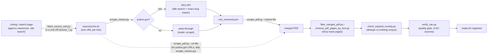

# Press-release scraping suite

This directory turns press-release **URLs** (or, for DOJ, structured **API records**) into clean, structured **PDFs** for CaseNoesis ingestion. This file is the onboarding doc: what each script does, and how they fit together. For the deep mechanics of extraction (host-specific selectors, Jina fallback, troubleshooting) see `PRESS_RELEASE_SCRAPING.md`. For the source-expansion priority queue and the crime-verify quality gate, see `EXPAND_SOURCES.md`.

## The pipeline, in one picture



Two things to notice:

1. **URL collection and PDF conversion are separate steps, done by separate tools.** `fetch_source_urls.py` extracts URLs from sites with multiple press release embedded. `scrape_noesis.py` and `scrape_pdf.py` turns URLs into PDFs. Neither step invents the other's data — an empty/wrong `urls.txt` produces an empty/wrong PDF no matter how good the extractor is.
2. **`scrape_noesis.py` is a router, not a replacement for `scrape_pdf.py`.** It only exists because `justice.gov` cannot be scraped directly (see "Why DOJ is different" below). Every other source flows through unchanged — you can skip `scrape_noesis.py` entirely if your `urls.txt` has no `justice.gov` links.

## Suite map

| File | Role |
|---|---|
| `scrape_pdf.py` | **The core engine.** Fetches a URL (or reads a `--noesis-file` record), extracts title/byline/body/date, lays out one PDF page with ReportLab, and merges all pages into one PDF with `pypdf`. Has per-host extractor logic for ~20 agency sites, a Jina Reader fallback for bot-gated hosts, and native-PDF handling (`pdfplumber`) for sources that publish `.pdf` directly. |
| `scrape_noesis.py` | **DOJ API bridge / recommended entry point.** Reads a url-file; routes `justice.gov` URLs to the DOJ press-release API instead of scraping them live (Akamai-gated — see below), and passes every other URL through unchanged. Outputs JSON that `scrape_pdf.py --noesis-file` consumes. |
| `fetch_source_urls.py` | **URL harvester.** Turns a listing/search page (or paginated template) into a deduplicated URL list — the input `scrape_noesis.py`/`scrape_pdf.py` need. Handles plain HTML pagination, Squarespace search API, Google CSE, search.usa.gov, and more. |
| `filter_merged_pdf.py` | Post-hoc noise filter: drop pages from an already-merged PDF by URL pattern or body keyword, rebuilding from the per-URL `tmp/` cache (no re-scrape needed), and optionally rewrite a cleaned url-file. |
| `remove_pdf_pages_by_text.py` | Simpler variant: drop pages from a merged PDF whose extracted text matches an exclude regex. |
| `check_expand_novelty.py` | **Dedup / novelty gate.** Before appending a new scrape batch to an existing merged corpus, confirms the new URLs/bodies are actually novel (not already in the baseline PDF) and that the batch itself has no internal duplicate Source URLs. Required step in the `EXPAND_SOURCES.md` workflow. |
| `sources/urls.txt` | Active input list — one URL per line, `#` comments allowed. What you hand to `scrape_noesis.py` or `scrape_pdf.py --url-file`. |
| `PRESS_RELEASE_SCRAPING.md` | Deep guide: extraction internals, the full host-by-host selector table, the DOJ-API rationale in detail, troubleshooting table, weekly-refresh automation pattern. Read this when an extractor needs fixing or you're adding a new host. |
| `EXPAND_SOURCES.md` | ICAC source-expansion tracking table (which agencies are done / queued) and the required CAC-verify workflow (`scripts/verify/verify_cac.py`) before a new source's merged PDF is considered ingestion-ready. |

## Install

```bash
pip install requests beautifulsoup4 reportlab pypdf pdfplumber
```

## Quickstart

### You already have a list of article URLs

If none of them are `justice.gov`:

```bash
cd scripts/scraper
python3 scrape_pdf.py --url-file sources/urls.txt \
  --out-dir ../.. --out-name MY_SOURCE_All.pdf --jina-fallback
```

If the list might include `justice.gov` URLs (DOJ press releases, USAO releases), route through `scrape_noesis.py` first — this avoids the Akamai bot-wall entirely by using the DOJ API instead of scraping:

```bash
cd scripts/scraper
python3 scrape_noesis.py --url-file sources/urls.txt --out sources/urls_resolved.json
python3 scrape_pdf.py --noesis-file sources/urls_resolved.json \
  --out-dir ../.. --out-name MIXED_BATCH_All.pdf
```

### You only have a listing/search page — no article URLs yet

Harvest first, then run either quickstart above on the resulting file:

```bash
cd scripts/scraper
python3 fetch_source_urls.py \
  --url 'https://www.example.gov/search?q=trafficking' \
  --same-host --path-prefix /news/ \
  --require-any trafficking \
  --exclude /search --exclude /tag/ --exclude /feed/ \
  -o sources/example_trafficking_urls.txt

python3 scrape_pdf.py --url-file sources/example_trafficking_urls.txt \
  --out-dir ../.. --out-name EXAMPLE_TRAFFICKING_All.pdf --jina-fallback
```

Smoke-test with `--limit 3` before running a full list. See `PRESS_RELEASE_SCRAPING.md` → "Canonical workflow" for the full step-by-step (verify one article in a browser, harvest hygiene, one-URL extractor probe) before scraping hundreds of URLs.

## Why DOJ (`justice.gov`) is different

`www.justice.gov/usao-*/pr/*` sits behind an Akamai Bot Manager JS interstitial (a proof-of-work challenge page, confirmed host-wide, not per-release) — direct `requests`/`curl` gets a ~2.4KB challenge shell, not the article, and even Jina Reader can independently refuse anonymous requests on network-reputation grounds. Solving that challenge would be bot-wall evasion, which this suite does not do. Instead, DOJ publishes a public press-release API (`/api/v1/press_releases.json`, no key required, 4 req/s limit) that returns the same content as structured JSON. `scrape_noesis.py` resolves `justice.gov` URLs against that API by matching the URL's slug exactly against API results (title-substring search alone isn't precise — DOJ sometimes republishes the same case under different title wording). Full details, including the API's undocumented query-param quirks, are in `PRESS_RELEASE_SCRAPING.md`.

## Output & caching

- `scrape_pdf.py` writes one PDF per URL under `{out-dir}/tmp/{index:04d}_{sha256(url)[:16]}.pdf`, then merges them into `{out-dir}/{out-name}`.
- Cache is keyed by URL hash, not position — safe to re-run with a different url-file without stale slot collisions. Re-running an unchanged URL prints `[cached]` and skips the fetch.
- To force a re-scrape (e.g. after fixing an extractor), delete the relevant `tmp/NNNN_{hash}.pdf` or the whole `tmp/` directory.
- Both `scrape_pdf.py` output PDFs and any `sources/*.json` intermediate files are covered by the repo's blanket `.gitignore` rules (`*.pdf`, `*.json`) — nothing generated by this suite needs to be committed by hand.

## After the merge: quality gates (ICAC sources)

For sources going into the ICAC/CAC corpus specifically, `EXPAND_SOURCES.md` documents the required post-merge steps: `check_expand_novelty.py` (no duplicate/already-seen cases) and `scripts/verify/verify_cac.py --all-failures --default-fail-csv` (every case must actually be a CAC-relevant press release, not a grant announcement, fugitive manhunt, or policy letter that slipped through the harvest filters). Not every source needs this — it's specific to the ICAC expansion workflow — but it's the right pattern to reuse for any topic corpus (elder fraud, trafficking, etc.) where you're appending to an existing merged PDF over time.

## When to stop and ask a human

- A site requires login, CAPTCHA, or a paid API.
- Releases only exist on Facebook/PDF email blasts with no stable URL list.
- robots.txt or legal terms block automated access at the scale you need.
- The bot-wall in front of a host would require solving a JS challenge, not just changing headers — that's a "stop and ask," not a "try harder," the same call already made for `justice.gov`.
